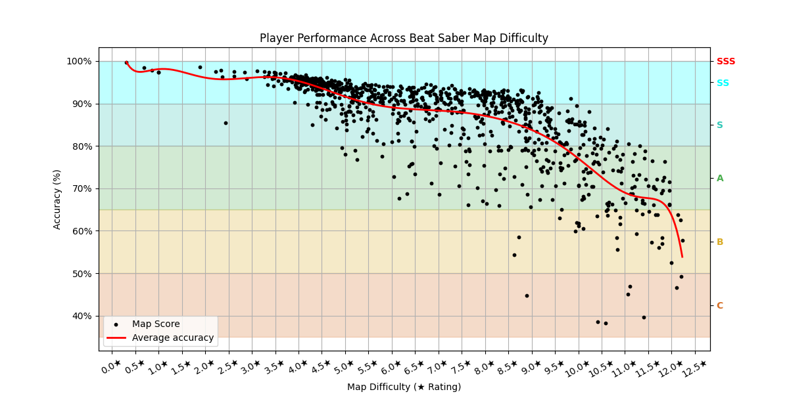
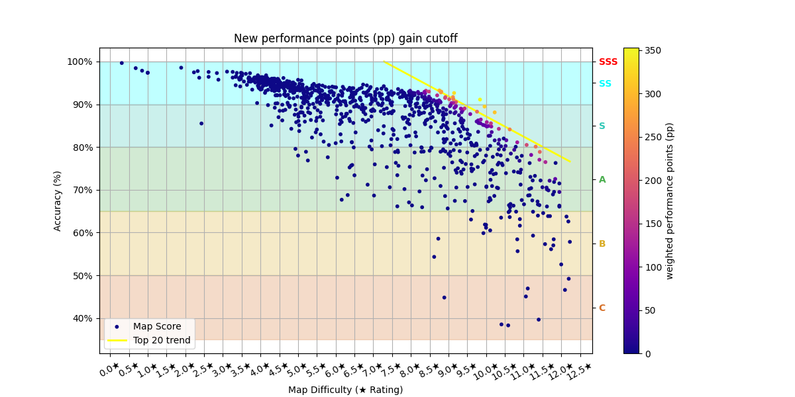

# Graph interpretations:

## Interpretation graph 1:

As map difficulty rises in ★, my accuracy drops and eventually collapses, indicating that my effective skill level is
around 9-9.5★ and that pushing into harder maps won’t yield new strong scores.

## Interpretation graph 2:

The yellow trendline (top-20 runs) reveals the threshold which I should aim for, for maximizing my true_pp gain, since
all scores are weighted down by their position in the descending raw_pp ranking using the formula: true_pp = raw_pp x
0.965 ^ map_index. pp... performance points

## Interpretation graph 3: